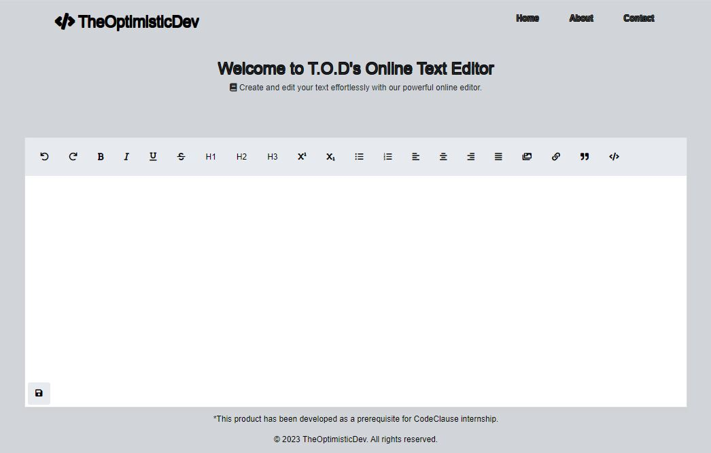
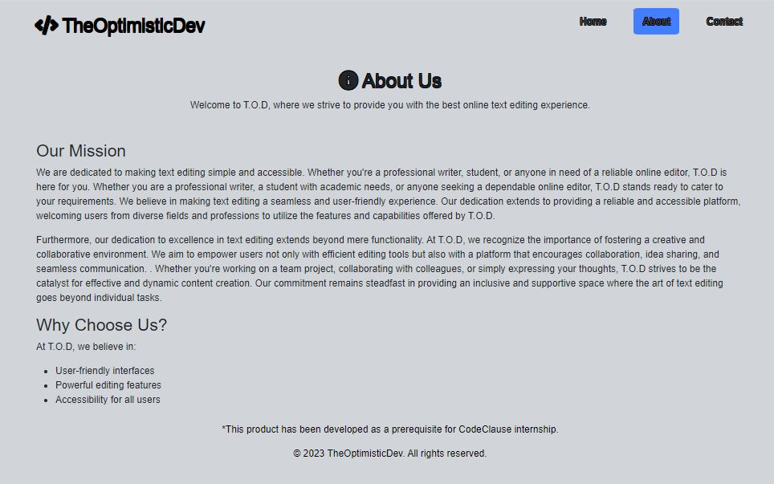
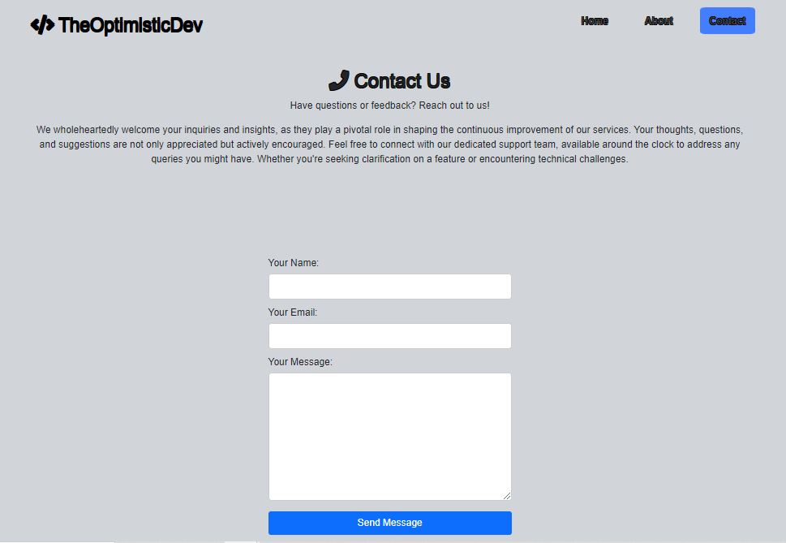

# TheOptimisticDev Online Text Editor

Welcome to TheOptimisticDev Online Text Editor! This web-based .txt editor was developed as a prerequisite for the CodeClause internship. It provides a seamless and efficient platform for document editing, allowing users to write, edit, and manage documents directly in the browser.

## Mock-ups







## Features

- **Intuitive Interface:** A user-friendly interface that makes coding a breeze.
- **Syntax Highlighting:** Enjoy syntax highlighting for various programming languages..

## Getting Started

### Prerequisites

Before you begin, ensure you have the following installed:

- Web browser (Chrome, Firefox, Safari, etc.)

### Installation

1. **Clone the repository:**

   ```bash
   git clone https://github.com/yourusername/codeclause_basic-text-editor.git

## Usage

1. Open `index.html` in your preferred web browser.

### Getting Started

1. Open the editor in your web browser.
2. Start coding in the provided editor pane.
3. Use the toolbar for additional features, such as running the code or collaborating with others.

## Contributing

We welcome contributions! If you'd like to contribute to TheOptimisticDev Online Editor, please follow these steps:

1. Fork the repository.
2. Create a new branch: `git checkout -b feature/my-feature`.
3. Make your changes and commit them: `git commit -m 'Add some feature'`.
4. Push to the branch: `git push origin feature/my-feature`.
5. Submit a pull request.

## License

This project is licensed under the [MIT License](LICENSE.md).

## Acknowledgments

This project utilizes icons from [Font Awesome](https://fontawesome.com/) for enhancing the user interface.
Also utilizes icons from [Favicon](https://favicon.io/) for favicon.

## Contact

If you have any questions or feedback, feel free to reach out to us at [mabunda.wealth@gmail.com](mailto:mabunda.wealth@gmail.com).
